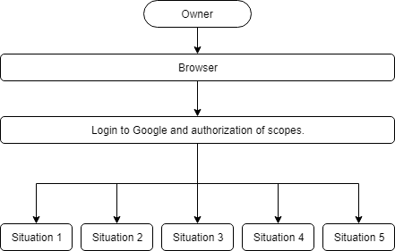
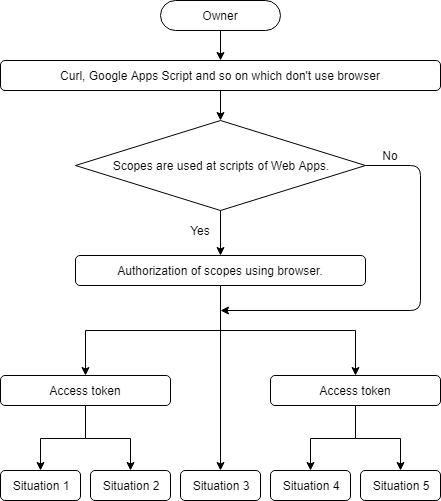
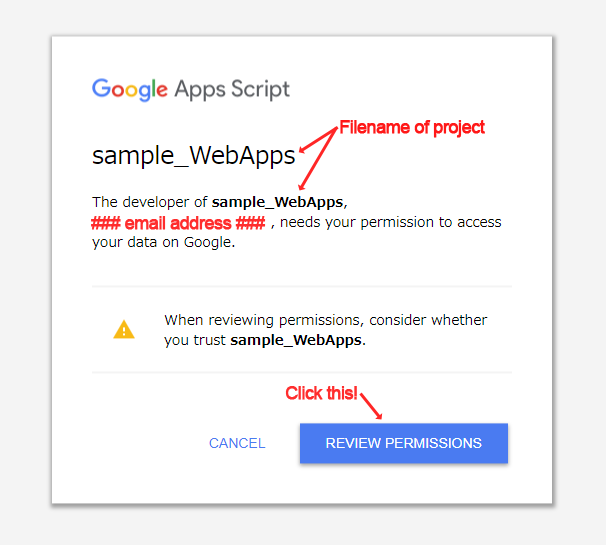

Taking advantage of Web Apps with Google Apps Script
=====

<a name="TOP"></a>
[](LICENCE)

# Table of contents
- [Overview](#overview)
- [Description](#description)
- [Deploy Web Apps](#deploywebApps)
- [5 situations for Web Apps](#situationsforwebapps)
    - [How to access to Web Apps](#howtoaccesstowebapps)
        - [1. Owner accesses to Web Apps using browser](#howtoaccesstowebapps1)
        - [2. Client users access to Web Apps using browser](#howtoaccesstowebapps2)
        - [3. Owner accesses to Web Apps using Curl, Google Apps Script and so on which don't use browser](#howtoaccesstowebapps3)
        - [4. Client users access to Web Apps using Curl, Google Apps Script and so on which don't use browser](#howtoaccesstowebapps4)
    - [Required parameters for accessing to deployed Web Apps](#requiredparameters)
    - [Authorization for scopes](#authorizationforscopes)
    - [Access token for accessing to Web Apps](#accesstokenforaccessingtowebapps)
    - [Share project of Web Apps with client users](#shareproject)
- [How to use dev mode from outside](#howtousedevmode)
- [Event object of Web Apps](#eventobject) <sup><font color="Red">Added at March 31, 2019</font></sup>
- [Limitation of simultaneous connection to Web Apps](#limitationofsimultaneousconnection)
- [Error messages](#errormessages)
- [Confidentiality of scripts for Web Apps](#confidentialityofscripts)
- [Sample script of server side](#samplescriptofserverside)
- [Sample scripts of client side](#samplescriptofclientside)
- [Status code from Web Apps](#statuscodefromwebapps)
- [Applications](#applications)
- [Sample situations](#samplesituations)

<a name="overview"></a>
# Overview
This is a report to take advantage of Web Apps with Google Apps Script (GAS).

<a name="description"></a>
# Description
There is [Web Apps](https://developers.google.com/apps-script/guides/web) as one of applications using Google Apps Script (GAS). I sometimes use this Web Apps. But I have only a little the information for the specification of Web Apps. So in order to take more advantage of Web Apps, I investigated and summarized about this. The aim of this report is to become one of the basic information for creating various applications using Web Apps with GAS.

<a name="deploywebapps"></a>
# Deploy Web Apps
When Web Apps is deployed, you can see the following window.


For setting, generally, the following flow is used.

- On script editor
- Publish -> Deploy as web app...
    - Project version:
        - "New" and input the description.
    - Pattern 1: <u>Execute the app as:</u>
        - **Me**
            - <u>Who has access to the app:</u>
                - **Only myself**
                - **Anyone**
                - **Anyone, even anonymous**
    - Pattern 2: <u>Execute the app as:</u>
        - **User accessing the web app**
            - <u>Who has access to the app:</u>
                - **Only myself**
                - **Anyone**
    - Click Deploy.

There are **Me** and **User accessing the web app** for "Execute the app as:" and **Only myself**, **Anyone** and **Anyone, even anonymous** for "Who has access to the app:" as the options. When **Me** and **User accessing the web app** are selected for "Execute the app as:", each "Who has access to the app:" has 3 and 2 options, respectively. From above flow, It is found that there are 5 situations for deploying Web Apps. For each situation, there are 2 methods of GET and POST.

In this report, I would like to introduce about the specification for Web Apps deployed by 5 situations.

<a name="situationsforwebapps"></a>
# 5 situations for Web Apps
1. **Situation 1**
    - "Execute the app as:" : **Me**
    - "Who has access to the app:": **Only myself**
1. **Situation 2**
    - "Execute the app as:" : **Me**
    - "Who has access to the app:": **Anyone**
1. **Situation 3**
    - "Execute the app as:" : **Me**
    - "Who has access to the app:": **Anyone, even anonymous**
1. **Situation 4**
    - "Execute the app as:" : **User accessing the web app**
    - "Who has access to the app:": **Only myself**
1. **Situation 5**
    - "Execute the app as:" : **User accessing the web app**
    - "Who has access to the app:": **Anyone**

<a name="howtoaccesstowebapps"></a>
## How to access to Web Apps
There are 5 situations for the deployed Web Apps, as mentioned above. And the methods for accessing to the deployed Web Apps are divided into 2 types. Those are the method which accesses using browser and the method which accesses using Curl, Google Apps Script and so on which don't use browser. Each method is used by the owner of Web Apps and the client users. The flow which summarized them is as follows.

<a name="howtoaccesstowebapps1"></a>
### 1. Owner accesses to Web Apps using browser


- For Situation 1, 4
    - Owner can access and run the script of Web Apps by the login to Google.
- For Situation 2, 5
    - Owner can access and run the script of Web Apps by the login to Google.
- For Situation 3
    - Owner can access and run the script of Web Apps without the login to Google.

<a name="howtoaccesstowebapps2"></a>
### 2. Client users access to Web Apps using browser


- For Situation 1, 4
    - Client users cannot access and run the script of Web Apps.
- For Situation 2, 5
    - Client users can access and run the script of Web Apps by the login to Google.
- For Situation 3
    - Client users can access and run the script of Web Apps without the login to Google.

<a name="howtoaccesstowebapps3"></a>
### 3. Owner accesses to Web Apps using Curl, Google Apps Script and so on which don't use browser


- For Situation 1, 4
    - Owner can access and run the script of Web Apps by using the access token.
- For Situation 2, 5
    - Owner can access and run the script of Web Apps by using the access token.
- For Situation 3
    - If the script of Web Apps uses some scopes, owner has to authorize the scopes by own browser.
    - Owner can access and run the script of Web Apps without the login to Google.

<a name="howtoaccesstowebapps4"></a>
### 4. Client users access to Web Apps using Curl, Google Apps Script and so on which don't use browser


- For Situation 1, 4
    - Client users cannot access and run the script of Web Apps.
- For Situation 2, 5
    - **At first, the project that Web Apps was deployed has to be shared with client users who use Web Apps.**
        - **I confirmed that from April 11, 2018, it is required to be shared the project to access to Web Apps. This might be due to the update of Google.**
    - If the script of Web Apps uses some scopes, client users have to authorize the scopes by own browser.
    - Client users can access and run the script of Web Apps without the login to Google.
- For Situation 3
    - If the script of Web Apps uses some scopes, client users have to authorize the scopes by own browser.
    - Client users can access and run the script of Web Apps without the login to Google.

<a name="requiredparameters"></a>
## Required parameters for accessing to deployed Web Apps
The simple explanations for above 5 situations were summarized as the following table. Owner and client users mean the owner who deployed Web Apps and the users who use the deployed Web Apps, respectively.

| Situations | Script of Web Apps | Authorization for scopes | Owner | Client users | Share project |
|:---|:---|:---|:---|:---|:---|
| Situation 1 | Run as owner. | Only owner | Access with access token. | Cannot access. | No |
| Situation 2 | Run as owner. | Only owner | Access with access token. | Access with access token. | Yes |
| Situation 3 | Run as owner. | Only owner | Access without access token. | Access without access token. | No |
| Situation 4 | Run as each user. | Each user | Access with access token. | Cannot access. | No |
| Situation 5 | Run as each user. | Each user | Access with access token. | Access with access token. | Yes |

For example, at situation 5, the script of Web Apps is run as each user (owner and client users). The authorization for the scopes of scripts of Web Apps is required to run the scripts. This authorization has to be done by each user (owner and client users) using own browser. The access token is required for each user (owner and client users) to access to Web Apps. In order to access to Web Apps from client users, the project deployed Web Apps has to be shared with the users.

<a name="authorizationforscopes"></a>
## Authorization for scopes
- When Web Apps is deployed as **``"Execute the app as:" : Me``** by owner, the authorization screen is automatically opened. When the owner authorizes it, owner and client users can run the scripts of Web Apps as the owner.

    - <u>**For example**</u>, in this situation, when ``Session.getEffectiveUser().getEmail()`` is run in this situation by the client users, the retrieved email is the owner's email. From this, it is found that the script is run as the owner.

    - <u>**For example**</u>, in this situation, when ``DriveApp.createFile(blob)`` is run at the script of Web Apps, the file is created in the owner's Google Drive.

- When Web Apps is deployed as **``"Execute the app as:" : User accessing the web app``** by owner, the authorization screen is **NOT** opened automatically. So before owner and client users access to Web Apps, they have to manually authorize to use the scopes by own browser.

    - If some scopes are used for the scripts of Web Apps, owner and client users have to authorize them only one time using own browser, before it accesses to Web Apps.

        - The URL for authorizing is ``https://script.google.com/macros/s/#####/exec`` which is the same to URL of Web Apps. When owner and client users access to the URL using own browser, the following authorization screen is displayed.

            - 

        - When you see above screen, please click "REVIEW PERMISSIONS". And select account and authorize to use the scopes. After owner and client users authorized the scopes, they can run the script of Web Apps.

    - <u>**For example**</u>, in this situation, when ``Session.getEffectiveUser().getEmail()`` is run in this situation by the client users, the retrieved email is the each user's email. From this, it is found that the script is run as each user.

    - <u>**For example**</u>, in this situation, when ``DriveApp.createFile(blob)`` is run at the script of Web Apps, the file is created in the each user's Google Drive.

<a name="accesstokenforaccessingtowebapps"></a>
## Access token for accessing to Web Apps
- When Web Apps is deployed as **``"Who has access to the app:": Only myself``** or **``"Who has access to the app:": Anyone``** by owner, the owner and client users have to access and run the script of Web Apps with own access token.

    - At least, one of scopes for using Drive API is required to be included in the access token. For example, those are
        - ``https://www.googleapis.com/auth/drive.readonly``
        - ``https://www.googleapis.com/auth/drive.files``
        - ``https://www.googleapis.com/auth/drive``

    - Even if the server script uses the scopes except for scripts to use Drive API, the scopes except for scopes for Drive API are not required to be included. Because the use of other scopes is authorized by the browser, before it accesses to Web Apps. This means that when it accesses to Web Apps by GET or POST request, only the scopes for using Drive API are required.

    - For example, when you want to access to Web Apps using GAS, even if you use ``{"Authorization": "Bearer " + ScriptApp.getOAuthToken()}`` to the headers, when the error of ``<TITLE>Unauthorized</TITLE>`` occurs, please confirm the scopes of the scripts at the script editor. If ``https://www.googleapis.com/auth/drive`` is not included in the scopes, please add it. In order to add it, for example, you can put ``// DriveApp.getFiles()`` in the scripts **as a comment**. By this, the script editor will automatically include ``https://www.googleapis.com/auth/drive``.

- If no scopes are used for the scripts of Web Apps, owner and client users can run the script of Web Apps without the authorization of scopes using own browser. But the access token is required to access to Web Apps, if it is **``"Who has access to the app:": Only myself``** or **``"Who has access to the app:": Anyone``**.

- Only when it is **``"Who has access to the app:": Anyone, even anonymous``**, owner and client users can access to Web Apps without the access token.

<a name="shareproject"></a>
## Share project of Web Apps with client users
When client users access to Web Apps with Situation 2 and 5, the owner of Web Apps is required to share the project deployed Web Apps with the client users. If the project is not shared, the error message of ``<title>Google Drive - Access Denied</title>`` is returned. For example, if the project is the container-bound script with Spreadsheet, please share the spreadsheet with the client users.

For sharing the project, you can [manually share it](https://support.google.com/drive/answer/2494822) and use "VIEW" to the permissions.

Also you can share the project using GAS scripts. The sample GAS script for sharing the project with the client users is as follows. When you use this, please input email and fileId. For example, if the project is the container-bound script with Spreadsheet, the fileId is that of spreadsheet. If you want to send a notification email when the project is shared, please modify from ``sendNotificationEmail=false`` to ``sendNotificationEmail=true``.

~~~javascript
// DriveApp.getFiles() // This comment is used for including a scope of https://www.googleapis.com/auth/drive. Of course, you can use Manifests for the project.
var email = "### Client user's email address ###";
var fileId = "### fileId of project ###";

var url = "https://www.googleapis.com/drive/v3/files/" + fileId + "/permissions?sendNotificationEmail=false";
var params = {
    method: "post",
    headers: {"Authorization": "Bearer " + ScriptApp.getOAuthToken()},
    contentType: "application/json",
    payload: JSON.stringify({
        "role": "reader",
        "type": "user",
        "emailAddress": email,
    }),
    muteHttpExceptions: true,
};
var res = UrlFetchApp.fetch(url, params);
Logger.log(res);
~~~


<a name="howtousedevmode"></a>
# How to use dev mode from outside
When you deploy Web Apps, you can see the link labeled **latest code**. The link is like ``https://script.google.com/macros/s/###/dev``. The official document of Google is as follows.

>  This URL can only be accessed by users who have edit access to the script. This instance of the app always runs the most recently saved code — not necessarily a formal version — and is intended for quick testing during development.

When you access to the link of **latest code** using your browser under you login to Google, you can access to Web Apps with the dev mode. But if you want to access to Web Apps with the dev mode from outside, there are no documents for the method. Here, it introduces such method.

When it accesses to the URL of **latest code** from outside, the login screen is returned. **This situation indicates that it is required to use the access token for accessing to the URL.** So as a sample, I show you the sample curl command as follows. The requirement scope is ``https://www.googleapis.com/auth/drive``.

### Requesting to doGet()
~~~bash
curl -L \
  -H "Authorization: Bearer ### access token ###" \
  "https://script.google.com/macros/s/#####/dev"
~~~

Also from [Standard Query Parameters](https://developers.google.com/drive/api/v3/query-parameters), you can use the following method using the access token as the query parameter.

~~~bash
curl -L "https://script.google.com/macros/s/#####/dev?access_token=### access token ###"
~~~

- Replace ``### access token ###`` to the value retrieved by ScriptApp.getOAuthToken().
- Replace ``https://script.google.com/macros/s/#####/dev`` to your endpoint retrieved by deploying Web Apps.

### Requesting to doPost()
~~~bash
curl -L \
  -H "Authorization: Bearer ### access token ###" \
  -d "key=value" \
  "https://script.google.com/macros/s/#####/dev"
~~~

Also from [Standard Query Parameters](https://developers.google.com/drive/api/v3/query-parameters), you can use the following method using the access token as the query parameter.

~~~bash
curl -L \
  -d "key=value" \
  "https://script.google.com/macros/s/#####/dev?access_token=### access token ###"
~~~

- Replace ``### access token ###`` to the value retrieved by ScriptApp.getOAuthToken().
- Replace ``https://script.google.com/macros/s/#####/dev`` to your endpoint retrieved by deploying Web Apps.
- I used ``-d "key=value"`` for the post method. If you don't want to put the values, please replace to ``-d ""``.


## Note
- By using above method, you can use the latest script of Web Apps from outside.
- If you want to use the dev mode as simple test, there is a simple method for retrieving the access token.
    1. Login to Google and open the script editor.
    1. Copy and paste the following script.
        - ``function getAccesstoken() {Logger.log(ScriptApp.getOAuthToken())} // DriveApp.getFiles()``
    1. Run the function ``getAccesstoken()`` and retrieve the access token.

By this, you can test it using the retrieved access token.

- This method was answered at [https://stackoverflow.com/a/54191688/7108653](https://stackoverflow.com/a/54191688/7108653).


<a name="eventobject"></a>
# Event object of Web Apps
When Web Apps is used, ``doGet(e)`` and ``doPost(e)`` are used for the GET and POST method, respectively. Here, it introduces the event object of ``e``.

## Sample script of Web Apps
The sample script for GET and POST method of Web Apps is as follows.

~~~javascript
function doGet(e) {
  e.method = "GET";
  return ContentService.createTextOutput(JSON.stringify(e)).setMimeType(ContentService.MimeType.JSON);
}

function doPost(e) {
  e.method = "POST";
  return ContentService.createTextOutput(JSON.stringify(e)).setMimeType(ContentService.MimeType.JSON);
}
~~~

## Sample client for accessing to Web Apps.
As a sample client, curl is used.

### Pattern 1
#### Sample curl
~~~bash
$ curl -L "https://script.google.com/macros/s/#####/exec?key1=value1&key2=value2&key3=value3"
~~~

#### Result
~~~json
{
  "parameter": {
    "key1": "value1",
    "key2": "value2",
    "key3": "value3"
  },
  "contextPath": "",
  "contentLength": -1,
  "queryString": "key1=value1&key2=value2&key3=value3",
  "parameters": {
    "key1": [
      "value1"
    ],
    "key2": [
      "value2"
    ],
    "key3": [
      "value3"
    ]
  },
  "method": "GET"
}
~~~

### Pattern 2
#### Sample curl
~~~bash
$ curl -L -d "key1=value1" -d "key2=value2" "https://script.google.com/macros/s/#####/exec?key3=value3"
~~~

#### Result
~~~json
{
  "parameter": {
    "key1": "value1",
    "key2": "value2",
    "key3": "value3"
  },
  "contextPath": "",
  "contentLength": 23,
  "queryString": "key3=value3",
  "parameters": {
    "key1": [
      "value1"
    ],
    "key2": [
      "value2"
    ],
    "key3": [
      "value3"
    ]
  },
  "postData": {
    "type": "application/x-www-form-urlencoded",
    "length": 23,
    "contents": "key1=value1&key2=value2",
    "name": "postData"
  },
  "method": "POST"
}
~~~

### Pattern 3
#### Sample curl
~~~bash
$ curl -L -d '{"key1": "value1", "key2": "value2"}' "https://script.google.com/macros/s/#####/exec?key3=value3"
~~~

#### Result
~~~json
{
  "parameter": {
    "key3": "value3",
    "{\"key1\": \"value1\", \"key2\": \"value2\"}": ""
  },
  "contextPath": "",
  "contentLength": 36,
  "queryString": "key3=value3",
  "parameters": {
    "key3": [
      "value3"
    ],
    "{\"key1\": \"value1\", \"key2\": \"value2\"}": [
      ""
    ]
  },
  "postData": {
    "type": "application/x-www-form-urlencoded",
    "length": 36,
    "contents": "{\"key1\": \"value1\", \"key2\": \"value2\"}",
    "name": "postData"
  },
  "method": "POST"
}
~~~

### Pattern 4
#### Sample curl
~~~bash
$ curl -L -H "Content-Type: application/json" -d '{"key1": "value1", "key2": "value2"}' "https://script.google.com/macros/s/#####/exec?key3=value3"
~~~

#### Result
Although the JSON object is sent as ``application/json`` and Web Apps recognizes the data as ``application/json``, the JSON parse of ``contents`` is not parsed. Please be careful this. In this case, it is required to parse using ``JSON.parse()``.

~~~json
{
  "parameter": {
    "key3": "value3"
  },
  "contextPath": "",
  "contentLength": 36,
  "queryString": "key3=value3",
  "parameters": {
    "key3": [
      "value3"
    ]
  },
  "postData": {
    "type": "application/json",
    "length": 36,
    "contents": "{\"key1\": \"value1\", \"key2\": \"value2\"}",
    "name": "postData"
  },
  "method": "POST"
}
~~~


<a name="limitationofsimultaneousconnection"></a>
# Limitation of simultaneous connection to Web Apps
The limitation of simultaneous connection is also investigated. The fetchAll method added by recent Google's update was used for this investigation. [I have reported that the fetchAll method is worked by the asynchronous processing.](https://gist.github.com/tanaikech/c0f383034045ab63c19604139ecb0728) This can be used for measuring the limitation of simultaneous connection. From the result of measurement, it was found that the limitation of simultaneous connection to one Web Apps server is under 30. [This is the same with scripts.run method of Apps Script API.](https://github.com/tanaikech/RunAll)

When ["Current limitations" of "Quotas for Google Services"](https://developers.google.com/apps-script/guides/services/quotas#current_limitations), it says that the simultaneous executions is 30.


<a name="errormessages"></a>
# Error messages
When the error messages are returned from Web Apps, you can see the messages into the tag of ``<title>### Error message ###</title>`` including in HTML output. From the error messages, you can know the reason of the error using the following table. I think that there may be other errors. So if you found them, when you tell me them, I'm glad.

| Execute the app as | Who has access to the app | Access | Status code | Error messages | Reason |
|:---|:---|:---|:---|:---|:---|
| User accessing the web app | Only myself,<br>Anyone | Owner,<br>Users | 200 | Authorization needed | Scopes for scripts of Web Apps are not authorized. |
| User accessing the web app,<br>Me | Only myself,<br>Anyone | Owner,<br>Users | 200 | Meet Google Drive – One place for all your files | No access token. |
| For all settings | For all settings | Owner,<br>Users | 200 | Error | "Service invoked too many times in a short time: exec qps. Try Utilities.sleep(1000) between calls." is shown in Body. |
| User accessing the web app,<br>Me | Only myself,<br>Anyone | Owner,<br>Users | 401 | Unauthorized | Bad access token.<br>No required scopes. |
| User accessing the web app,<br>Me | Anyone | Users | 403 | Google Drive - Access Denied | Project of Web Apps is not shared with users. |
| User accessing the web app,<br>Me | Only myself | Users | 404 | Google Drive -- Page Not Found | Users cannot access. |

<a name="confidentialityofscripts"></a>
# Confidentiality of scripts for Web Apps
- If you don't want to publish the scripts of Web Apps, you can achieve it using Situation 3.
    - In this case, anybody can access the Web Apps.

- If you want to make only the special users access to Web Apps, you can achieve it using Situation 2 and 5.
    - In this case, the scripts of Web Apps can be seen by the users, because the project of scripts has to be shared with the users.

<a name="samplescriptofserverside"></a>
# Sample script of server side
The simple sample-script of server side (Web Apps) is as follows. When the client users access to this server, the server returns URL query and the request body which were sent by the client. And also a text file is created. In this script, the scope of ``https://www.googleapis.com/auth/drive`` is used for creating a text file. So when you use this script at Situation 4 and Situation 5 as mentioned above, at first, please authorize the scope by accessing to Web Apps using your browser. After the authorization was done, the text file is created by requesting the following scripts for the client side.

~~~javascript
function feedback(e, method) {
    var id = "";
    var user = Session.getEffectiveUser().getEmail();
    if (e.parameter.key1 == "value1") {
        id = DriveApp.createFile("sample.txt", "Created by " + user, MimeType.PLAIN_TEXT).getId();
    }
    return ContentService.createTextOutput(JSON.stringify({
        result: Object.keys(e.parameters).map(function(f) {return f + "," + e.parameters[f]}),
        method: method,
        createdFile: id ? id + " was created by " + user : "Not created.",
    })).setMimeType(ContentService.MimeType.JSON);
}

function doGet() {
    return feedback(e, "GET");
}

function doPost() {
    return feedback(e, "POST");
}
~~~

<a name="samplescriptofclientside"></a>
# Sample scripts of client side
## Access with access token
### GET
#### Curl

~~~bash
curl -GL \
  -H "Authorization: Bearer ### your access token ###" \
  -d "key1=value1" \
  -d "key2=value2" \
  "https://script.google.com/macros/s/#####/exec?key3=value3"
~~~

#### Google Apps Script

~~~javascript
// DriveApp.getFiles() // This comment is used for including a scope of https://www.googleapis.com/auth/drive.
var params = {
    method: "GET",
    headers: {"Authorization": "Bearer " + ScriptApp.getOAuthToken()},
    muteHttpExceptions: true,
};
var url = "https://script.google.com/macros/s/#####/exec?key1=value1&key2=value2&key3=value3";
var res = UrlFetchApp.fetch(url, params);
Logger.log(res);
~~~

### POST
#### Curl

~~~bash
curl -L \
  -H "Authorization: Bearer ### your access token ###" \
  -d "key1=value1" \
  -d "key2=value2" \
  "https://script.google.com/macros/s/#####/exec?key3=value3"
~~~

#### Google Apps Script

~~~javascript
// DriveApp.getFiles() // This comment is used for including a scope of https://www.googleapis.com/auth/drive.
var params = {
    method: "POST",
    headers: {"Authorization": "Bearer " + ScriptApp.getOAuthToken()},
    payload: {key1: "value1", key2: "value2"},
    muteHttpExceptions: true,
};
var url = "https://script.google.com/macros/s/#####/exec?key3=value3";
var res = UrlFetchApp.fetch(url, params);
Logger.log(res);
~~~

## Access without access token
### GET
#### Curl

~~~bash
curl -GL \
  -d "key1=value1" \
  -d "key2=value2" \
  "https://script.google.com/macros/s/#####/exec?key3=value3"
~~~

#### Google Apps Script

~~~javascript
var params = {
    method: "GET",
    muteHttpExceptions: true,
};
var url = "https://script.google.com/macros/s/#####/exec?key1=value1&key2=value2&key3=value3";
var res = UrlFetchApp.fetch(url, params);
Logger.log(res);
~~~

### POST
#### Curl

~~~bash
curl -L \
  -d "key1=value1" \
  -d "key2=value2" \
  "https://script.google.com/macros/s/#####/exec?key3=value3"
~~~

#### Google Apps Script

~~~javascript
var params = {
    method: "POST",
    payload: {key1: "value1", key2: "value2"},
    muteHttpExceptions: true,
};
var url = "https://script.google.com/macros/s/#####/exec?key3=value3";
var res = UrlFetchApp.fetch(url, params);
Logger.log(res);
~~~

<a name="statuscodefromwebapps"></a>
# Status code from Web Apps
Here, I would like to introduce the status code returned from Web Apps.

## Preparation:
As the preparation, Web Apps was deployed with "Execute the app as" and "Who has access to the app" as `Me` and `Anyone, even anonymous`, respectively. The sample script for Web Apps is as follows.

```javascript
function doGet(e) {return ContentService.createTextOutput("GET: Done.")}
```

## Experiment:
### Using Google Apps Script:
At first, the status code was checked using Google Apps Script. The deployed Web Apps was requested with the following script.

```javascript
function myFunction() {
  var url_exec = "https://script.google.com/macros/s/###/exec";
  var url_dev = "https://script.google.com/macros/s/###/dev";
  var res = UrlFetchApp.fetchAll([{url: url_exec}, {url: url_dev}]);
  res.forEach(function(e) {
    Logger.log(e.getResponseCode());
  });
}
```

In this case, the status code of `200` was obtained for both endpoints of `exec` and `dev`.

### using Curl:
In order to retrieve the status code with curl, `curl -s -o /dev/null -w "%{http_code}" http://www.example.org/` was used. This is from [this thread](https://superuser.com/questions/272265/getting-curl-to-output-http-status-code). Here, the status code was investigated using the curl command. Because the curl can access by 2 kinds of request by the options as showing below.

1. [`--include`](https://curl.haxx.se/docs/manpage.html#-i): Include the HTTP response headers in the output. The HTTP response headers can include things like server name, cookies, date of the document, HTTP version and more...

2. [`--head`](https://curl.haxx.se/docs/manpage.html#-I): (HTTP FTP FILE) Fetch the headers only! HTTP-servers feature the command HEAD which this uses to get nothing but the header of a document. When used on an FTP or FILE file, curl displays the file size and last modification time only.

Using above options, the following 4 patterns were investigated.

1. Request to the endpoint of `https://script.google.com/macros/s/###/exec` using the option `--include`.
	- `curl -sL --include -o /dev/null -w "%{http_code}" "https://script.google.com/macros/s/###/exec"`
	- `200` was returned.
1. Request to the endpoint of `https://script.google.com/macros/s/###/dev` using the option `--include`.
	- `curl -sL --include -o /dev/null -w "%{http_code}" "https://script.google.com/macros/s/###/dev"`
	- `200` was returned.
1. Request to the endpoint of `https://script.google.com/macros/s/###/exec` using the option `--head`.
	- `curl -sL --head -o /dev/null -w "%{http_code}" "https://script.google.com/macros/s/###/exec"`
	- **`403` was returned.**
1. Request to the endpoint of `https://script.google.com/macros/s/###/dev` using the option `--head`.
	- `curl -sL --head -o /dev/null -w "%{http_code}" "https://script.google.com/macros/s/###/dev"`
	- `200` was returned.

As the result, it was found that when the Web Apps of the endpoint of `https://script.google.com/macros/s/###/exec` was requested with the option `--head`, the status code of `403` was obtained.

## Result and discussions:
When the option `--head` is used for the curl command, from the document, this means that it requests only header and doesn't request the body. By this, it was found that the status code of `403` was returned.

Here, why was the status code of `200` returned for both options of `--include` and `--head` when it requests to the endpoint of `dev`? It is considered that the reason of this is due to that the login screen was returned. When the endpoint of `dev` is accessed, it is required to use the access token. When the access token is not used, the login screen is returned. In this case, the status code of `200` is returned. As the test case, when the access token is used for the endpoint of `dev` using below curl command,

```bash
curl -sL --head -H "Authorization: Bearer ###" -o /dev/null -w "%{http_code}" "https://script.google.com/macros/s/###/dev"
```

The status code of `403` was returned. From this result, the following results were obtained.

- When only the header is retrieved under that the Web Apps works fine, `403` is returned.
- When the login screen is returned, `200` is returned.

## Applications for this situation
###
As one of applications using this situation, there is the registration of webhook at [Trello's REST API](https://developers.trello.com/reference/).

When the Web Apps which was deployed as `Execute the app as: Me` and `Who has access to the app: Anyone, even anonymous` is registered as the webhook, an error of `{"message":"URL (https://script.google.com/macros/s/###/exec) did not return 200 status code, got 403","error":"ERROR"}` occurs. The reason of this error is due to above situation. So as the workaround for the registration, you can use the following flow.

- Before you run the script, please set the Web Apps as follows.
	- "Execute the app as" and "Who has access to the app" are `Me` and `Only myself`, respectively.
- After the response of like `{"id":"###","description":"sample","idModel":"###","callbackURL":"https://script.google.com/macros/s/###/exec","active":true}` was retrieved, please set the Web Apps as follows.
	- "Execute the app as" and "Who has access to the app" are `Me` and `Anyone, even anonymous`, respectively.

By this flow, the webhook can be used.

#### Sample script
This is a sample script of Google Apps Script for the registration of webhook URL.

```javascript
var url = 'https://api.trello.com/1/tokens/###/webhooks/?key=###'
var payload = { 
  "callbackURL": "https://script.google.com/macros/s/###/exec",
  "idModel":"###",
  "description": "sample"
}
var options = {method: "post", payload: payload};
var res = UrlFetchApp.fetch(url,options);
Logger.log(res.getContentText())
```

---

<a name="applications"></a>
## Applications
Here, I would like to introduce the applications of Web Apps. If you can introduce your applications, please tell me. I would like to introduce them here.

### 1. Converting from a1Notation to GridRange
This is a sample API for [converting from a1Notation to GridRange](https://gist.github.com/tanaikech/95c7cd650837f33a564babcaf013cae0). The GridRange is often used at Sheets API. Although I have thought that a1Notation is easy to use, there are no methods for converting it. So I created this as an API. I would like to introduce this as a sample for this report.

The sample script is as follows. At first, please copy and paste it to new standalone project.

~~~javascript
function doGet(e) {
  var output = {};
  if (e.parameter.sheetid && e.parameter.a1notation) {
    output = {result: a1notation2gridrange1(e.parameter.sheetid, e.parameter.a1notation)};
  } else {
    output = {error: "Wrong parameters."};
  }
  return ContentService.createTextOutput(JSON.stringify(output));
}

// https://gist.github.com/tanaikech/95c7cd650837f33a564babcaf013cae0
function a1notation2gridrange1(sheetid, a1notation) {
  try {
    var data = a1notation.match(/(^.+)!(.+):(.+$)/);
    var ss = SpreadsheetApp.openById(sheetid).getSheetByName(data[1]);
    var range = ss.getRange(data[2] + ":" + data[3]);
    var gridRange = {
      sheetId: ss.getSheetId(),
      startRowIndex: range.getRow() - 1,
      endRowIndex: range.getRow() - 1 + range.getNumRows(),
      startColumnIndex: range.getColumn() - 1,
      endColumnIndex: range.getColumn() - 1 + range.getNumColumns(),
    };
    if (!data[2].match(/[0-9]/)) delete gridRange.startRowIndex;
    if (!data[3].match(/[0-9]/)) delete gridRange.endRowIndex;
    return gridRange;
  } catch (e) {
    return e;
  }
}
~~~

And then, please deploy this as Web Apps. The condition is as follows.

- "Execute the app as:" : **User accessing the web app**
- "Who has access to the app:": **Only myself**

By this condition, owner and each client user can use Spreadsheets on own Google Drive. Before you access to Web Apps, please don't forget to share the project to users. The usage is as follows. This is a curl sample. But of course, you can also use this API using Google Apps Script.

~~~bash
curl -GL \
  -H "Authorization: Bearer ### your access token ###" \
  -d "sheetid=### spreadsheet ID ###" \
  -d "a1notation=Sheet1%21A1%3aB2" \
  "https://script.google.com/macros/s/#####/exec"
~~~

When you use this, please do URL encode for the range.

### 2. URL to upload to Google Drive
[https://stackoverflow.com/questions/47833728/url-to-upload-to-google-drive](https://stackoverflow.com/questions/47833728/url-to-upload-to-google-drive)

### 3. How to get a data range of the Sheet
[https://stackoverflow.com/questions/48917258/how-to-get-a-data-range-of-the-sheet](https://stackoverflow.com/questions/48917258/how-to-get-a-data-range-of-the-sheet)

---

<a name="samplesituations"></a>
# Sample situations
Here, I would like to introduce the sample situations with Web Apps. Those are threads of Stackoverflow. You can see the actual situations using Web Apps from them.

- [How to upload a file via POST (doPost) to a Google Script's Web App?](https://stackoverflow.com/a/42217817)
- [How to use importXML function with a file from Google Drive?](https://stackoverflow.com/a/45991519)
- [Retrieving the output of a Google Apps script to local computer](https://stackoverflow.com/a/46106339)
- [URL to upload to Google Drive](https://stackoverflow.com/a/47841498)
- [Using AuthToken obtained via ScriptApp.getAuthToken() to call web apps in GAS](https://stackoverflow.com/a/48840870)
- [Is there any limit on number of concurrent hits on Google App Script Web App](https://stackoverflow.com/a/50033976)
- [Uploading files to pre-set Google Drive account using API?](https://stackoverflow.com/a/50206254)
- [can't open Slack dialog through google apps scripts](https://stackoverflow.com/a/51093107)
- [using an http request to update google spreadsheet](https://stackoverflow.com/a/53383507)
- [Trying to use dev mode with GAS doPOST](https://stackoverflow.com/a/54191688)
- [Google Sheets View Only Protection for User Running App Script](https://stackoverflow.com/a/54452680)
- [How to assign UrlFetchApp with basic authorization to button?](https://stackoverflow.com/a/54622357)
- [Protecting Cells of Spreadsheet that Users Copied from Your Google Drive to User's Google Drive using Google Apps Script](https://gist.github.com/tanaikech/847ea7e3e27a4a22004faa88d7b4dedb)
- [Maintaining protected ranges while copying a file](https://stackoverflow.com/a/57066732)
- [How to create webhook from Google Apps Script using the “exec” url rather than “dev” url. Exec returns 403 Error](https://stackoverflow.com/a/57426103)
- [One Time Download for Google Drive](https://github.com/tanaikech/One_Time_Download_for_Google_Drive)
- [Open a HTML file with data using Google Script](https://stackoverflow.com/q/58055279)
- [Receiving Access-Control-Allow-Origin errors when submiting a form via Google Apps Script](https://stackoverflow.com/q/58773436)
- [How to do curl POST of CSV data?](https://stackoverflow.com/q/58847822)
- [How to POST from JS or node.js?](https://stackoverflow.com/q/58849644)

---

# References
- [Web Apps](https://developers.google.com/apps-script/guides/web)

---

<a name="licence"></a>
# Licence
[MIT](LICENCE)

<a name="author"></a>
# Author
[Tanaike](https://tanaikech.github.io/about/)

If you have any questions, feel free to tell me using e-mail tanaike@hotmail.com Also if you found new information related to this report and tell me them, I am glad. I would like to update this report.

<a name="update_history"></a>
# Update History
* v1.0.0 (April 26, 2018)

    Initial release.

[TOP](#TOP)
